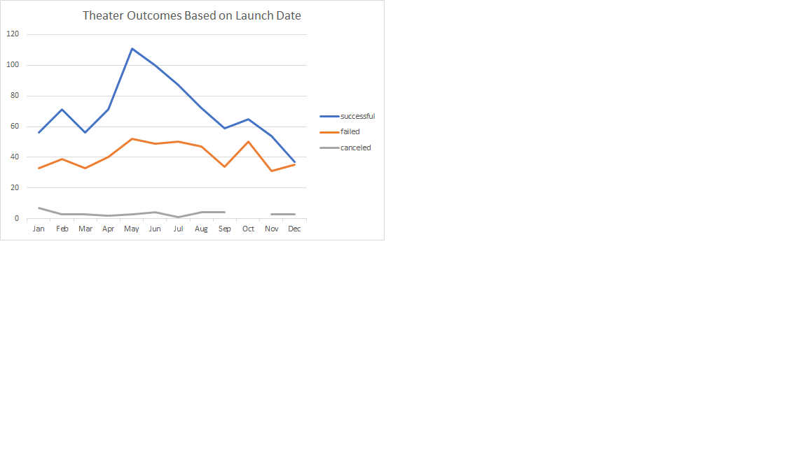
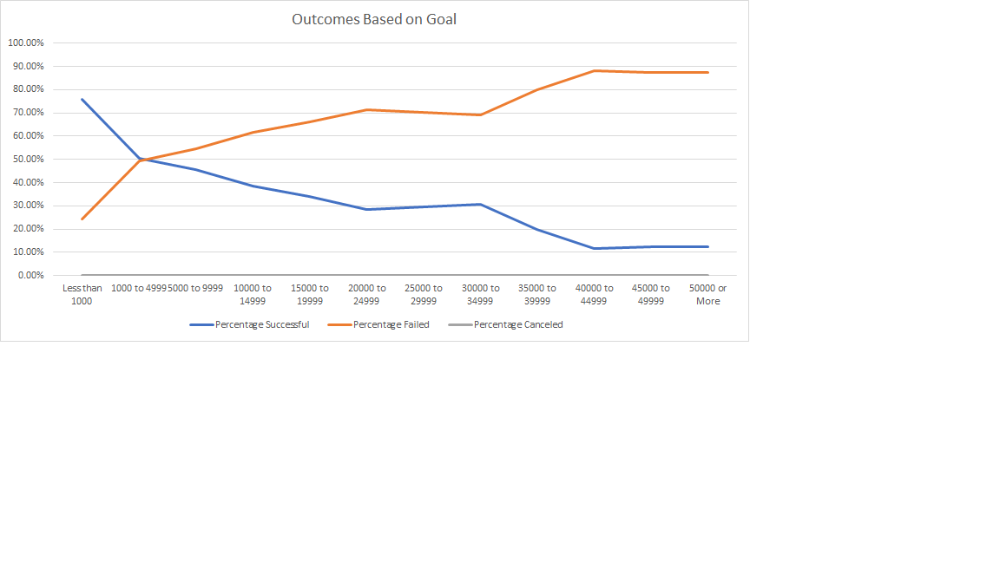

# Kickstarting with Excel

## Overview of Project
The Kickstarter project is comprised of data from various fundraising campaigns throughout the world. 
### Purpose
The purpose of the project is to breakdown the Kickstarter campaign to analyze data based on location, monetary goals, campaign categories, and other criteria. In addition, I will document the results of the analysis based on the following outcomes: Theater campaigns based on launch date and Outcome of campaigns based on the monetary goal.
## Analysis and Challenges

### Analysis of Theater Outcomes Based on Launch Date

When filtering the Kickstarter campaigns by the theater subcategory, date of launch, and outcome (i.e., successful, failed, and canceled) there was a positive trend for successful and failed events during May-June and September-October. The number of events were the highest during May-June, however, the number of failed events represented almost half of the events. Canceled events were rare but did not effect the overall trend for successful or failed events. 

### Analysis of Outcomes Based on Goals
When filtering the Kickstarter campaigns by the play subcategory, success rate, monetary goal, and outcome, there was a positive trend for failed campaigns and negative trend for successful campaigns. The most successful campaigns occurred when the goal was the lowest and conversely the campigns that failed the most also represent the highest goals. As result, successful plays with a low monetary goal are proven to be successful campaigns.

### Challenges and Difficulties Encountered
The challenges faced for this project include the integrity of the data. I was not able to validate whether the monetary amounts were based on actual funds received or if the conversion rates were accurate if using United States Dollars. 
## Results

- What are two conclusions you can draw about the Theater Outcomes based on Launch Date?
Overall, theater events show a trend for half of the shows doing well. Additionally, theater shows are more likely to be successful during May-June or September to October.

- What can you conclude about the Outcomes based on Goals?
The lower the goal the more successful the campaign will be.

- What are some limitations of this dataset?
Limitations include not know the monetray denomination to compare apples to apples. For example, are campaigns from the US comparable to UK campaigns?

- What are some other possible tables and/or graphs that we could create?
An overall success rate by category or outcome of theater campaigns by subcategory. This will highlight what type of events are the most successful and the specific theater events that contribute to the success rate.
